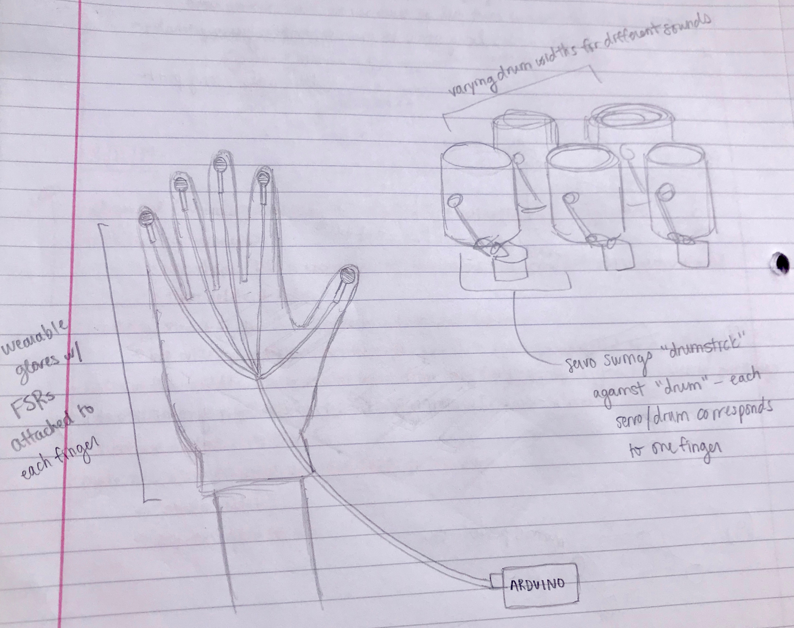

Concept:
Literal "finger drumming" - user wears a glove that measures which fingers are tapping against any surface, which corresponds to various "drums."

Sketch:

Parts needed:
5 FSRs, glove (or fabric to make a glove), 5 servo motors, 5 drums (combination of wood and metal...maybe cans can work as well)

Top 3 questions:
1. How can I best run 5 servo motors at one time? 
2. What material would be best for the drums?
3. Is this project feasible?

FINAL DOCUMENTATION: https://github.com/cassieulvick/MachineLab/blob/master/FinalProject/documentation.md
