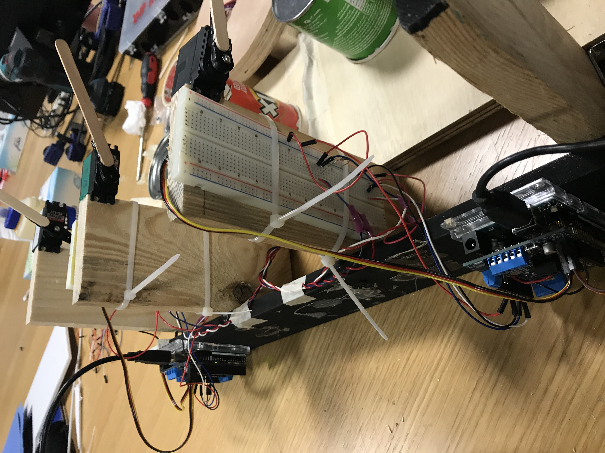

FINAL PROJECT DOCUMENTATION

OVERALL CONCEPT

My final project involves the concept of finger drumming. I wanted to turn the act of drumming your fingers, such as on a table, into a physical instrument - when the user drums each of their fingers, individual "actual" drums will be played, giving both visual and auditory amplification to a simple finger motion that most people do.

DEMO VIDEO

https://youtu.be/ZwqEvP2Jsmc

OVERALL PICTURE

IMPORTANT PARTS

- 4 servo motors
- 4 FSRs
- 4 "drums" (empty cans with the opening face taped closed tightly with masking tape)
- 2 Arduino Unos + 2 motor shields (2 servo motors and 2 FSRs attach to each board)

SCHEMATIC

Each motor shield/Arduino board has the following structure:

ELECTRONICS PICTURES

CODE

This same code was uploaded to each Arduino Uno:
https://github.com/cassieulvick/MachineLab/blob/master/FinalProject/finalProjectCode.ino

HOW IT WORKS

Each motor shield and Arduino board are connected to two FSRs and two servo motors. Each FSR corresponds to one servo motor. When the user touches an FSR, the corresponding servo moves down and up, which allows the attached popsicle stick to drum the corresponding can. Since each can is a different size, they all emit different tones.

HOW IT WAS BUILT + PROBLEMS ENCOUNTERED

I started out by testing the mechanism of getting the FSR to trigger the servo motor drum. I initially did this by mapping the FSR values to the position of the servo motor, which allowed for an effective "bang" sound. After this, I hooked up the remaining three FSRs and servo motors. Jack suggested using two Arduinos and two motor shields, putting two servo motors on each Arduino board, because it would be difficult to control four servos on one board.

The next step was making a good drum. Taking inspiration from an online article (https://www.wikihow.com/Make-a-Homemade-Drum), I decided to collect some cans with varying sizes and cover the openings with masking tape. However, instead of having the "drumstick" bang on the taped side, I attached it to bang on the metal side, as it made a better sound.
Next, I built the structure of the instrument. The structure to hold the drums and servos were pretty straightforward, but I struggled more with how to place the FSRs. I initially wanted to create a wearable glove, and attach the FSRs to where the user's fingertips go. I did find a glove in the IM lab, but it was very awkward to wear since my hand was way too small for it - my fingers didn't reach the tips where the FSR would ideally be placed. To accommodate this issue, I decided to have a control board of sorts instead of a glove. The FSRs are placed on top of a circle wood block, so that the user can comfortably rest their hand on it, regardless of size.

The biggest issue I struggled with was how to move the servo arm. Different people would interact with the FSRs in different ways. Some would tap the FSRs very lightly, while others would press harder on them. This was an issue when the FSR values were mapped to the servo positions: if the user tapped too lightly, the drumstick would never hit the drum. If the user pressed down too hard, then there was too much tension on the part where the servo head connects to the motor, and the head would snap off. To accommodate this, I got rid of the mapping part of the code and replaced it with a conditional: any FSR value above 5 would result in the servo moving in a specific pre-programmed manner. After testing out different ranges of motion, I decided on 15 degrees since this generated more sound and was more immediate than a larger sweeping motion.
One thing I wish I was better able to resolve was the volume of the sound generated. It was pretty loud during the IM showcase, so you couldn't hear the drum sounds unless you moved your ears very close to the instrument. A little bit of the sound was also compromised when I re-coded how the servo reacts to the FSR being touched - when it was mapped, this generated better sound since the drumstick had more of a kickback after it hit the drum. If I were to rebuild this project in the future, the sound would be the biggest thing I would work on to improve.
